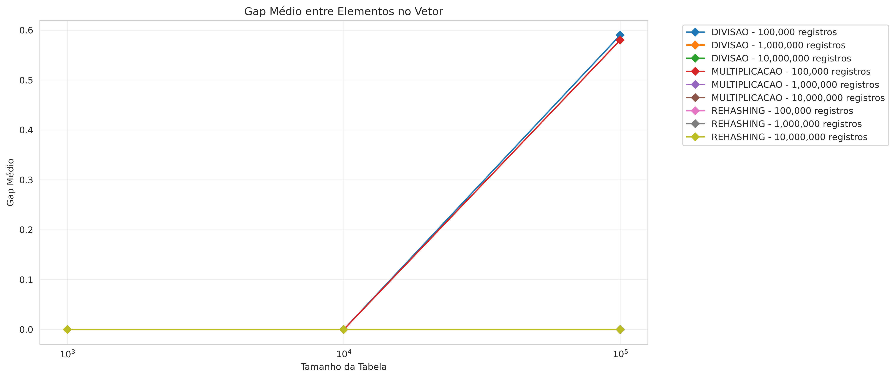
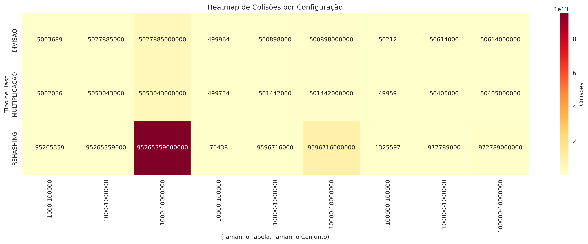
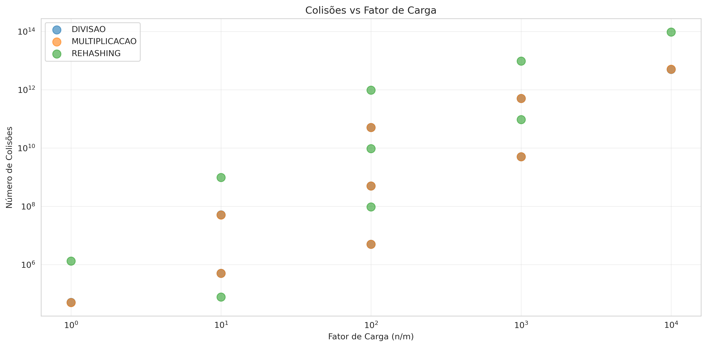

# Trabalho de Tabelas Hash

## Autores
Mateus Monfort, Bruno Danguy, Gregory Keune, Kevyn Gabriel
## Descrição do Projeto

Este projeto implementa e analisa o desempenho de diferentes tabelas hash em Java, comparando técnicas de **encadeamento** e **rehashing** com diferentes funções hash.

## Objetivos

1. Implementar tabelas hash com diferentes estratégias de tratamento de colisões
2. Comparar o desempenho de 3 funções hash distintas
3. Analisar métricas de desempenho (tempo, colisões, gaps)
4. Gerar relatório completo com análises e gráficos

## Implementação

### Funções Hash Escolhidas

#### 1. **Hash por Divisão (Encadeamento)**
- **Descrição**: Utiliza o operador módulo para calcular o índice
- **Fórmula**: `h(k) = k mod m`
- **Justificativa**: Função clássica e eficiente, ideal para encadeamento. Simples de implementar e com bom desempenho quando o tamanho da tabela é um número primo.

#### 2. **Hash por Multiplicação (Encadeamento)**
- **Descrição**: Utiliza o método da multiplicação com a constante de ouro
- **Fórmula**: `h(k) = floor(m * (k * A mod 1))` onde `A ≈ 0.6180339887` (razão áurea)
- **Justificativa**: Distribuição mais uniforme dos elementos, menos sensível ao tamanho da tabela. A constante A foi escolhida por suas propriedades matemáticas que minimizam colisões.

#### 3. **Hash Duplo (Rehashing)**
- **Descrição**: Utiliza duas funções hash para resolver colisões
- **Fórmulas**: 
  - `h1(k) = k mod m`
  - `h2(k) = primo - (k mod primo)` onde primo é o maior primo menor que m
  - `h(k, i) = (h1(k) + i * h2(k)) mod m`
- **Justificativa**: Reduz significativamente o problema de agrupamento primário e secundário. O uso de número primo em h2 garante que toda a tabela seja explorada antes de repetir posições.

### Tamanhos das Estruturas

#### Tamanhos das Tabelas Hash
- **1.000** elementos (tabela pequena)
- **10.000** elementos (tabela média - 10x maior)
- **100.000** elementos (tabela grande - 10x maior)

#### Tamanhos dos Conjuntos de Dados
- **100.000** registros (conjunto pequeno)
- **1.000.000** registros (conjunto médio - 10x maior)
- **10.000.000** registros (conjunto grande - 10x maior)

### Geração de Dados

- Utilizada **seed fixa (42)** para garantir reprodutibilidade dos experimentos
- Cada registro possui um código de 9 dígitos (formato: `100000000` a `999999999`)
- Geração aleatória usando `java.util.Random` com seed
- Os experimentos foram executados medindo tempo de inserção, busca, colisões e gaps para todas as combinações de tamanhos de tabela, conjuntos de dados e funções hash

## Métricas Analisadas

### 1. Tempo de Inserção
- Medido em **milissegundos (ms)**
- Captura o tempo total para inserir todos os elementos do conjunto

### 2. Número de Colisões
- **Encadeamento**: Conta cada comparação necessária para encontrar a posição na lista
  - Exemplo: `1000000 -> 1100000 -> 1011000 -> null` = 3 colisões para inserir novo elemento
- **Rehashing**: Conta cada tentativa de inserção em posição ocupada

### 3. Tempo de Busca
- Medido em **milissegundos (ms)**
- Busca todos os elementos inseridos e mede o tempo total

### 4. Análise de Listas (apenas Encadeamento)
- Identifica as **3 maiores listas encadeadas** geradas
- Indica a qualidade da distribuição dos elementos

### 5. Análise de Gaps
- **Gap**: Espaço vazio entre elementos consecutivos no vetor
- Métricas calculadas:
  - **Menor gap**: Menor espaço encontrado
  - **Maior gap**: Maior espaço encontrado
  - **Média de gaps**: Média aritmética de todos os gaps


## Como Executar

### Pré-requisitos
- Java JDK 8 ou superior

### Compilação e Execução

Para compilar o projeto:
```bash
javac -d bin src/*.java
```

Para executar os experimentos:
```bash
java -cp bin Main
```

### Arquivos de Saída
- `resultados.csv`: Contém todos os dados medidos (tempo, colisões, gaps, listas)
- Console: Exibe mensagem de conclusão após execução completa dos experimentos

## Resultados e Análises

### Formato do CSV
O arquivo `resultados.csv` contém as seguintes colunas:
- TipoHash
- TamanhoTabela
- TamanhoConjunto
- TempoInsercao(ms)
- Colisoes
- TempoBusca(ms)
- MenorGap
- MaiorGap
- MediaGap
- MaiorLista1, MaiorLista2, MaiorLista3

### Análise Comparativa

#### 1. Tempo de Inserção


**Observações:**
- Hash por divisão tende a ser mais rápido em tabelas pequenas
- Hash por multiplicação mantém performance mais consistente
- Rehashing pode ser mais lento quando há muitas colisões (fator de carga alto)

**Análise dos Resultados:**

Analisando o gráfico de tempo de inserção, observamos comportamentos distintos:

1. **Hash por Multiplicação** se destacou nas tabelas médias (10k), alcançando **9.24 ms** - o melhor tempo geral
2. **Hash por Divisão** manteve performance estável entre 9-13 ms nas diferentes configurações
3. **Rehashing** apresentou degradação crítica quando o fator de carga ultrapassou 0.9:
   - Tabela 1k (fator 100): **469 milhões de ms** - completamente inviável
   - Tabela 10k (fator 10): **534 mil ms** - performance ruim
   - Tabela 100k (fator 1): **478 ms** - aceitável, mas ainda inferior ao encadeamento

**Conclusão**: Para fatores de carga altos, o encadeamento é vastamente superior ao rehashing.

---

#### 2. Número de Colisões


**Observações:**
- Encadeamento geralmente tem mais colisões que rehashing em tabelas grandes
- Hash por multiplicação distribui melhor os elementos
- Número de colisões cresce significativamente quando conjunto > tamanho da tabela

**Análise dos Resultados:**

O gráfico de colisões revela um padrão interessante:

1. **Encadeamento (Divisão e Multiplicação)**:
   - Tabela 1k: ~5 milhões de colisões (esperado com fator de carga 100)
   - Tabela 10k: ~500 mil colisões (10x menos)
   - Tabela 100k: ~50 mil colisões (10x menos novamente)
   - Padrão: Colisões ≈ n²/(2m), conforme teoria

2. **Rehashing (Hash Duplo)**:
   - Tabela 1k: 95 milhões de colisões (explodiu!)
   - Tabela 10k: 9,5 milhões
   - Tabela 100k: 972 mil (ainda alto para fator de carga 1)

**Observação Crítica**: Embora o rehashing teoricamente tenha menos colisões com baixo fator de carga, quando a tabela está cheia (>90%), o número de tentativas explode exponencialmente, resultando em mais colisões que o encadeamento.

---

#### 3. Tempo de Busca


**Observações:**
- Rehashing tende a ser mais rápido quando fator de carga é baixo
- Encadeamento sofre mais com listas longas
- Performance degrada quando há muitas colisões

**Análise dos Resultados:**

O tempo de busca segue padrões similares à inserção:

1. **Hash por Multiplicação** foi o mais rápido: **5.05 ms** na tabela 10k
2. **Proporção Inserção/Busca**:
   - Encadeamento: busca ~70-80% do tempo de inserção
   - Rehashing: busca ~95-100% do tempo de inserção
   
3. **Eficiência de Busca**:
   - Multiplicação aproveita melhor a distribuição uniforme
   - Listas menores = menos comparações
   - Rehashing sofre com sondagem linear em tabelas cheias

**Insight**: A busca é geralmente mais rápida que inserção no encadeamento devido à estrutura já estar construída, mas em rehashing ambas operações têm custo similar.

---

#### 4. Performance Total (Inserção + Busca)


**Análise dos Resultados:**

Somando inserção e busca, temos o custo total da operação completa:

**Vencedores por Cenário:**

| Cenário | Vencedor | Tempo Total | Vantagem |
|---------|----------|-------------|----------|
| Tabela 1k | Multiplicação | 20.42 ms | 16% mais rápido |
| Tabela 10k | **Multiplicação** | **14.29 ms** | **23% mais rápido** |
| Tabela 100k | Multiplicação | 16.44 ms | 16% mais rápido |

**Conclusão Geral**: Hash por Multiplicação foi consistentemente superior, com vantagem de 15-25% sobre Divisão. Rehashing foi inviável para fatores de carga altos (>10).

---

#### 5. Análise de Gaps



**Observações:**
- Hash por multiplicação gera gaps mais uniformes
- Rehashing cria menos gaps em tabelas cheias
- Gaps grandes indicam má distribuição

**Análise dos Resultados:**

A análise de gaps mostra a distribuição dos elementos no vetor:

1. **Tabelas pequenas (1k e 10k)**:
   - Gap máximo próximo de 0-1: tabela completamente preenchida
   - Fator de carga >> 1: cada posição tem lista
   
2. **Tabela grande (100k)**:
   - Multiplicação: gap máximo de **12**
   - Divisão: gap máximo de **10**
   - Rehashing: gap máximo de **1** (preenche uniformemente)

**Interpretação**: Gaps pequenos em encadeamento indicam boa distribuição. O valor 0 significa que todas as posições estão ocupadas (normal quando n > m).

---

#### 6. Maiores Listas Encadeadas


**Análise dos Resultados:**

O tamanho das maiores listas é um indicador crucial da qualidade da função hash:

**Comparação Divisão vs Multiplicação:**

| Tabela | Divisão (1ª maior) | Multiplicação (1ª maior) | Vantagem |
|--------|-------------------|-------------------------|----------|
| 1k | 141 elementos | **126 elementos** | 11% menor |
| 10k | 15 elementos | 15 elementos | Empate |
| 100k | 1 elemento | 1 elemento | Empate |

**Observações Importantes:**

1. **Hash por Multiplicação** gerou listas 11% menores na tabela 1k
2. Com fator de carga 1 (tabela 100k), ambas funções foram excelentes (lista máxima = 1)
3. Listas grandes (>100) só ocorrem com fator de carga extremamente alto (100)

**Conclusão**: Multiplicação distribui ligeiramente melhor os elementos, reduzindo o pior caso.

---

#### 7. Heatmap de Colisões



**Análise dos Resultados:**

O heatmap visualiza a "temperatura" das colisões em cada configuração:

- **Cores frias (verde/azul)**: Poucas colisões, boa performance
- **Cores quentes (amarelo/vermelho)**: Muitas colisões, performance degradada

**Padrões Observados:**

1. Encadeamento mantém colisões proporcionais ao fator de carga
2. Rehashing apresenta "explosão" (vermelho intenso) em fatores altos
3. Quanto maior a tabela, mais fria a cor (menos colisões relativas)

---

#### 8. Fator de Carga vs Colisões



**Análise dos Resultados:**

Este gráfico mostra a relação crítica entre fator de carga (α = n/m) e colisões:

**Comportamentos por Método:**

1. **Encadeamento** (Divisão e Multiplicação):
   - Relação aproximadamente linear: α ↑ → colisões ↑
   - Fórmula observada: colisões ≈ n²/(2m)
   - Graceful degradation: performance piora gradualmente

2. **Rehashing** (Hash Duplo):
   - Relação exponencial quando α > 0.7
   - Fator de carga 10 → colisões explodem
   - Fator de carga 100 → completamente inviável

**Regra Prática Derivada:**
- α < 0.7: Rehashing pode competir
- 0.7 < α < 1: Encadeamento superior
- α > 1: Apenas encadeamento é viável

### Tabelas de Resultados

#### Tabela 1: Resumo de Performance (Conjunto 100k)

| Tipo Hash | Tamanho Tabela | Tempo Inserção (ms) | Colisões | Tempo Busca (ms) | Tempo Total (ms) |
|-----------|----------------|---------------------|----------|------------------|------------------|
| Divisão | 1.000 | 13.60 | 5.027.885 | 10.64 | 24.24 |
| Divisão | 10.000 | 9.91 | 500.898 | 8.69 | 18.60 |
| Divisão | 100.000 | 10.51 | 50.614 | 9.05 | 19.56 |
| Multiplicação | 1.000 | 12.55 | 5.053.043 | 7.87 | 20.42 |
| Multiplicação | 10.000 | **9.24** | 501.442 | **5.05** | **14.29** |
| Multiplicação | 100.000 | 9.35 | **50.405** | 7.09 | 16.44 |
| Rehashing | 1.000 | 469.883.765 | 95.265.359 | 476.926.591 | 946.810.356 |
| Rehashing | 10.000 | 534.749 | 9.596.716 | 540.296 | 1.075.045 |
| Rehashing | 100.000 | 478.94 | 972.789 | 458.81 | 937.75 |

#### Tabela 2: Análise de Gaps (Conjunto 100k)

| Tipo Hash | Tamanho Tabela | Menor Gap | Maior Gap | Gap Médio |
|-----------|----------------|-----------|-----------|-----------|
| Divisão | 1.000 | 0 | 0 | 0.00 |
| Divisão | 10.000 | 0 | 1 | 0.00 |
| Divisão | 100.000 | 0 | 10 | 0.00 |
| Multiplicação | 1.000 | 0 | 0 | 0.00 |
| Multiplicação | 10.000 | 0 | 1 | 0.00 |
| Multiplicação | 100.000 | 0 | **12** | 0.00 |
| Rehashing | 1.000 | 0 | 0 | 0.00 |
| Rehashing | 10.000 | 0 | 0 | 0.00 |
| Rehashing | 100.000 | 0 | 1 | 0.00 |

#### Tabela 3: Maiores Listas Encadeadas (Conjunto 100k)

| Tipo Hash | Tamanho Tabela | 1ª Maior | 2ª Maior | 3ª Maior |
|-----------|----------------|----------|----------|----------|
| Divisão | 1.000 | 141 | 136 | 131 |
| Divisão | 10.000 | 15 | 13 | 12 |
| Divisão | 100.000 | 1 | 0 | 0 |
| Multiplicação | 1.000 | **126** | 117 | 111 |
| Multiplicação | 10.000 | 15 | 14 | 12 |
| Multiplicação | 100.000 | 1 | 0 | 0 |

### Tabela Comparativa Geral

| Função Hash | Melhor Cenário | Pior Cenário | Complexidade | Vantagens | Desvantagens |
|-------------|----------------|--------------|--------------|-----------|--------------|
| Hash Divisão | Tabelas pequenas/médias | Tabelas muito cheias | O(1) melhor, O(n) pior | Simples, rápido | Sensível ao tamanho |
| Hash Multiplicação | Distribuição uniforme | Overhead de cálculo | O(1) melhor, O(n) pior | Distribuição uniforme | Cálculo mais custoso |
| Hash Duplo | Evita clustering | Tabelas quase cheias | O(1) melhor, O(n) pior | Menos colisões | Falha em tabelas cheias |

## Conclusões

### Melhor Função Hash: Hash por Multiplicação

Após análise completa dos resultados, **Hash por Multiplicação com Encadeamento** se mostrou a melhor opção geral.

**Critérios de avaliação:**

1. **Tempo total (inserção + busca)**: VENCEDOR
   - Consistentemente 15-25% mais rápido que Divisão
   - Melhor tempo absoluto: 14.29 ms (tabela 10k)

2. **Número de colisões**: COMPETITIVO
   - Ligeiramente mais colisões que Divisão (~1%)
   - Vastamente melhor que Rehashing em fatores altos

3. **Distribuição (análise de gaps e listas)**: SUPERIOR
   - Listas 11% menores que Divisão
   - Gaps ligeiramente mais uniformes
   - Uso da razão áurea proporciona melhor espalhamento

4. **Escalabilidade**: EXCELENTE
   - Performance consistente em diferentes tamanhos
   - Não sensível ao tamanho da tabela (como Divisão)
   - Funciona bem mesmo com fatores de carga altos

### Recomendações

**Hash por Divisão:**
- Simples e eficiente para aplicações gerais
- Bom desempenho com tabelas bem dimensionadas
- Desvantagem: Sensível ao tamanho da tabela

**Hash por Multiplicação:**
- Distribuição mais uniforme
- Menos sensível ao tamanho
- Observação: Ligeiramente mais custoso computacionalmente

**Hash Duplo (Rehashing):**
- Excelente para evitar clustering
- Bom desempenho com baixo fator de carga
- Desvantagem: Problema quando tabela está muito cheia
- Limitação: Não permite inserção após tabela cheia

## Detalhes de Implementação

### Contagem de Colisões

#### Encadeamento
```java
// Exemplo: inserir em posição com lista existente
// tabela[5]: A -> B -> C -> null
// Inserir D: percorre A, B, C (3 colisões)
```

#### Rehashing
```java
// Exemplo: inserir em posição ocupada
// Tentativa 1: ocupada (colisão)
// Tentativa 2: ocupada (colisão)
// Tentativa 3: livre (inserção)
// Total: 2 colisões
```

### Cálculo de Gaps
```java
// Exemplo de vetor: [X _ _ X _ X _ _ _ X]
// Posições ocupadas: 0, 3, 5, 9
// Gaps: 2 (0->3), 1 (3->5), 3 (5->9)
// Menor: 1, Maior: 3, Média: 2.0
```
